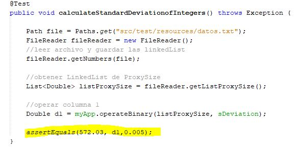

# OO-Design-ARSW

# TAREA 1 ARSW (OO Design)

Write a program to calculate the mean and standard deviation of a set of n real
numbers.
Your program reads the n real numbers from a file.
Use a linked list to store the n numbers for the calculations. (Note: You have
to write your own implementation of a linked list and it must be compliant
with Java’s collections API)

# LOC/h. Rendimiento

1. desde las 10:00pm hasta las 1:00am - 429 LOC
2. desde las 10:am hasta las 1:00am - 205 LOC

total LOC = (634/6) = 106LOC

##  106 LOC


# Documentación

la documentacion de este proyecto esta en la siguiente ruta del proyecto:

```
raiz /documentacion
```


# EMPEZAR

Copie el proyecto via git clone en cualquier diretorio para empezar a trabajar:
```
git clone https://github.com/vashigo/OO-Design-ARSW.git
```

## Prerequisitos

Tener instalado Java jdk versiones 7+, Maven comandos y git

## Instalando

1. Ejecutar en terminal:

```
$$ mvn package
```
2.(opcional):
si requiere la documentacion del codigo ejecute y estara en raiz /target:

```
mvn javadoc:javadoc
```

2. (Demostracion):
  compile el proyecto desde la carpeta raiz ejecutando la siguiente linea y mandando el archivo de datos:
  
```
java -cp target/app-1.0-SNAPSHOT.jar edu.escuelaing.arsw.tarea2.App src/main/resources/datos.txt
```
<p align="center">
 
</p>

# Application architecture design

### class Diagram

<p align="center">
 
</p>

# Test Report

### resultado de pruebas

<p align="center">
 
</p>

### pruebas

Prueba 1 | Prueba 2
------------ | ------------- 
 | 
En esta prueba se probaron los datos de la columna 1 y calculandole su media| En esta prueba se probaron los datos de la columna 1 y calculandole su Desviación Estandar

Prueba 3 | Prueba 4
------------ | ------------- 
 | 
En esta prueba se probaron los datos de la columna 2 y calculandole su media| En esta prueba se probaron los datos de la columna 2 y calculandole su Desviación Estandar

# Built con

* [Maven](https://maven.apache.org/) - Dependency Management
* [JAVA JDK 8](http://www.oracle.com/technetwork/java/javase/overview/index.html) - construcción
* [JUnit 3.8.1](https://mvnrepository.com/artifact/junit/junit/3.8.1) - Test Dependency


# Autor

* **ANDRES DAVID VASQUEZ IBAÑEZ** - *Initial work* - [VASHIGO](https://github.com/vashigo)


# Licencia

This project is licensed under the GNU General Public License - see the [LICENSE](LICENSE) file for details
